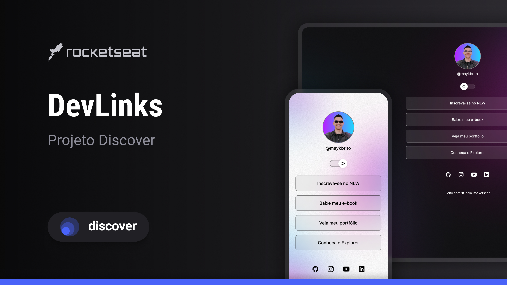
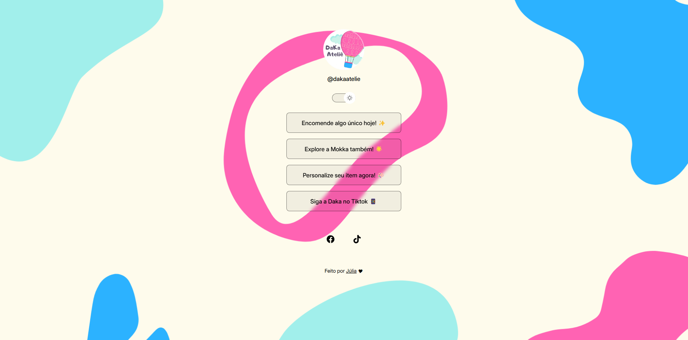

<h1 align="center"> Daka Atelie </h1>

  Este projeto foi criado para ajudar minha irmã a tornar a página dela mais acessível e amigável para os visitantes. 
  Aprendi a desenvolver tudo com o curso Discover da Rocketseat, aplicando os conhecimentos adquiridos para criar uma experiência mais intuitiva e agradável. 
  <a href="https://www.instagram.com/dakaatelie">Clique aqui para dar uma olhadinha na página dela.</a> 
  <a href="https://www.rocketseat.com.br">Clique aqui para ir ao site da Rocketseat.</a>

     Esse era o projeto inicial e eu modifiquei a aparência ao decorrer do curso.  

   Esse é o meu projeto.  
 

 

## 🚀 Tecnologias

Esse projeto foi desenvolvido com as seguintes tecnologias:

- HTML e CSS
- JavaScript
- Git e Github
- Figma

## 💻 Projeto

O DevLinks é um agregador de links para usar como cartão de visitas online.

- [Acesse o projeto finalizado, online](https://maykbrito.github.io/devlinks)

- [Assistir aulas](https://lp.rocketseat.com.br/devlinks/inscricao?utm_source=github&utm_medium=descricao&utm_campaign=capture-devlinks&utm_term=organic&utm_content=descricao-github-mayk-brito)

## 🔖 Layout

Você pode visualizar o layout do projeto através [DESSE LINK](https://www.figma.com/community/file/1187422022288947321). É necessário ter conta no [Figma](https://figma.com) para acessá-lo.

## 💕 Notinha

Fico feliz de poder aprender com a Rocketseat e poder ajudar a minha irmã com o trabalho artesanal dela.

Feito com ♥ by Julia :wave: [Me siga!](https://www.instagram.com/justmimikyu_)
